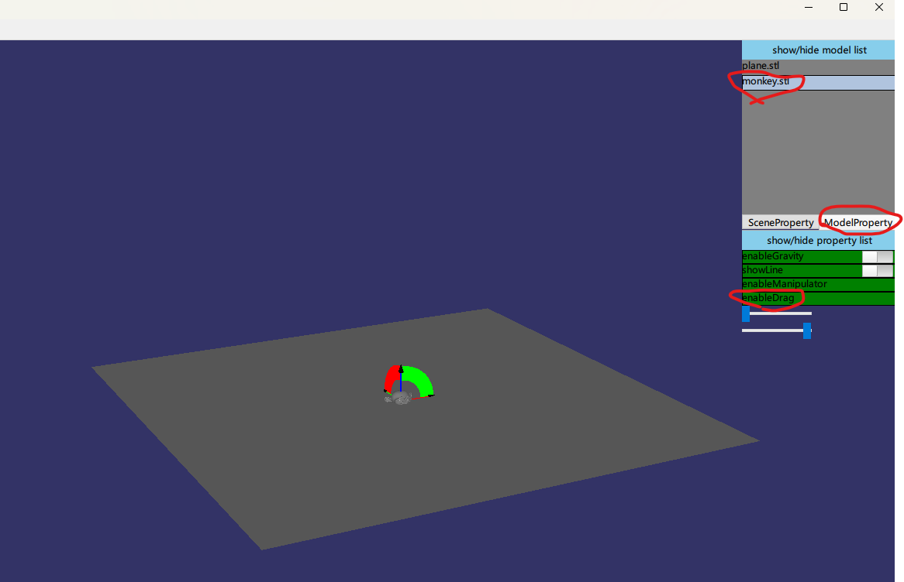
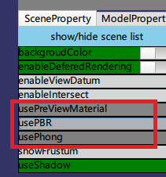

# RenderTests
## run demo

- download **/bin** directory
- execute **Creator.exe**
- click **Edit**-**model**，select **.stl** file(./plane.stl ./monkey.stl)

## model

- drag model:

  - click model in **ModelList  panel**
  - click **ModelProperty**
  - click **enableDrag**

  

## light

- set light mode:

  - click **SceneProperty**
  - **usePreViewMaterial**(default mode): use default light,
  - **usePBR**:  support point light
  - **usePhong** : support directional light、point light、spot light，support shadow

  
